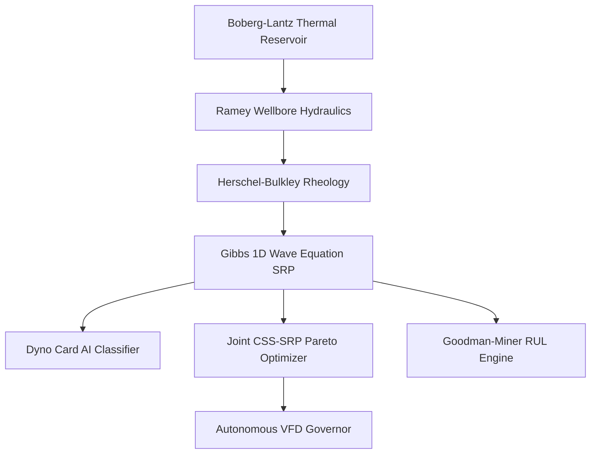

# Models, Physics Formulations & Data Sources
**AI-Enabled Well-to-Surface Digital Twin — Baghewala Field | Oil India Limited | SIH 2026**

---

## Architecture Overview

---

## 1. Physics Models

### 1.1 Boberg-Lantz Thermal Dissipation & Marx-Langenheim Steam Chamber
**File:** `core/physics/thermal_reservoir.py`

Injected heat and heated zone radius:
$$H_{inj} = V_{cwe} \cdot \rho_w \cdot [C_{pw}(T_{sat}-T_r) + f_s L_v]$$
$$r_h = \sqrt{\frac{H_{inj} \cdot F_{ML}}{\pi h_p M_r (T_{sat}-T_r)} + r_w^2}$$

Post-injection temperature decay:
$$T_{avg}(t) = T_r + (T_{sat}-T_r) \cdot \exp\!\left(-\sqrt{\frac{t_{soak}}{\tau_{eff}}}\right) \exp\!\left(-\sqrt{\frac{t}{\tau_{eff}}}\right) \exp(-\beta_{conv} t)$$

**Source:** Marx & Langenheim (1959), Boberg & Lantz (1966)

---

### 1.2 Walther-Andrade Viscosity Model
**File:** `core/physics/thermal_reservoir.py`

Calibrated for Baghewala 17–19° API crude:
$$\ln \mu_o(T) = A + \frac{B}{T_K} + \frac{C}{T_K^2} \quad (A=-5.85,\ B=3150\ \text{K},\ C=395000\ \text{K}^2)$$

| Temperature | Viscosity |
|------------|----------|
| 47°C (native) | 2,650 cP |
| 100°C | 145 cP |
| 220°C (steam) | 18 cP |

**Source:** Walther (1931) / ASTM D341

---

### 1.3 Thermal Multiphase IPR (Darcy-Vogel)
**File:** `core/physics/thermal_reservoir.py`

$$J(t) = \frac{2\pi k h_p}{\mu_o(T_{avg})\ln(r_h/r_w) + \mu_o(T_r)\ln(r_e/r_h)}$$
$$Q_{oil}(t) = J(t)\cdot(P_r - P_{wf})\cdot\left[1-0.2\left(\frac{P_{wf}}{P_r}\right)-0.8\left(\frac{P_{wf}}{P_r}\right)^2\right]$$

---

### 1.4 Ramey Wellbore Heat Transmission
**File:** `core/physics/wellbore_hydraulics.py`

$$T(z,t) = T_e(z) + (T_{sf}-T_e(z_{pump})) e^{-(z_{pump}-z)/A_R} + g_G A_R(1-e^{-(z_{pump}-z)/A_R})$$

**Source:** Ramey (1962)

---

### 1.5 Herschel-Bulkley Non-Newtonian Rheology
**File:** `core/physics/fluid_rheology.py`

$$\tau = \tau_y(T) + K(T)\cdot\dot{\gamma}^{n(T)}, \quad \mu_{app} = \frac{\tau_y}{\dot{\gamma}} + K\dot{\gamma}^{n-1}$$

Asphaltene Colloidal Instability Index:
$$\text{CII} = \frac{\text{Saturates\%} + \text{Asphaltenes\%}}{\text{Aromatics\%} + \text{Resins\%}} = 0.94 \quad (\text{High risk} > 0.90)$$

**Source:** Herschel & Bulkley (1926); Mullins et al. (2012)

---

### 1.6 Gibbs 1D Damped Wave Equation
**File:** `core/physics/sucker_rod_dynamics.py`

$$\frac{\partial^2 u}{\partial t^2} = a^2\frac{\partial^2 u}{\partial x^2} - c\frac{\partial u}{\partial t} + g\!\left(1-\frac{\rho_f}{\rho_r}\right) - F_{drag}(x,\mu,v)$$

Rod floating (carrier bar separation) criterion:
$$\text{Rod Floating} \iff \frac{F_{visc}}{W_{buoyant}} \ge 0.70 \quad \text{or} \quad a_{rod,max} < a_{carrier,peak}$$

Impact shock on reconnection:
$$F_{impact} = \frac{M_{rod}\cdot\beta_{eff}\cdot\Delta v}{\Delta t_{impulse}} \approx 8{,}000\text{–}15{,}000\ \text{lbs}$$

**Source:** Gibbs & Neely (1966); API RP 11L; Takacs (2015)

---

## 2. AI & Machine Learning Models

### 2.1 Dynamometer Card AI Classifier
**File:** `core/ml/dyno_card_classifier.py`
**Algorithm:** Random Forest (60 trees, Gini impurity, bootstrap sampling)

**12-feature input vector:**

| # | Feature | Description |
|---|---------|-------------|
| Φ₁ | Card area | Shoelace polygon area (work/stroke) |
| Φ₂ | MPRL/PPRL ratio | Load span |
| Φ₃, Φ₄ | Centroid (Xc, Yc) | Geometric center |
| Φ₅ | Downstroke dip | Carrier bar separation depth |
| Φ₆ | Impact spike | dF/dt at bottom-of-stroke |
| Φ₇ | Tilt skewness | Unanchored tubing hysteresis |
| Φ₈–Φ₁₀ | Fourier harmonics | Shape descriptors |
| Φ₁₁ | Upstroke slope | Inflow gradient |
| Φ₁₂ | Normalized peak load | vs. API tensile limit |

**8 Output Classes:** Normal Fillage · Severe Rod Floating · Fluid Pound · Gas Interference · Unanchored Tubing · Traveling Valve Leak · Standing Valve Leak · Pump Off

**Training corpus:** 480 physics-simulated cards across 5 temperatures × 4 viscosities × 3 SPM values × 8 fault types

---

### 2.2 Physics-Informed CSS Surrogate
**File:** `core/ml/surrogate_model.py`

Analytical reduction of Boberg-Lantz + Darcy-Vogel + Economic NPV:
$$\text{NPV} = N_p \cdot P_{oil} - V_{steam} \cdot C_{steam} - E_{lift} \cdot C_{elec} - \text{OPEX}$$

Evaluation speed: **< 1.5 ms per 120-day cycle** (enables real-time Pareto search)

---

### 2.3 Joint CSS-SRP Multi-Objective Pareto Optimizer
**File:** `core/ml/joint_optimizer.py`

$$\min_{\mathbf{x}} \{-\text{NPV},\ \text{SOR},\ E_{lift},\ N_{float\_days}\}$$

Dynamic SPM cooling schedule:
$$\text{SPM}^*(T) = \begin{cases} 7.5 & T \ge 130°C \\ 6.2 - 0.8\tfrac{130-T}{45} & 85 \le T < 130°C \\ 4.2 - 0.6\tfrac{\mu-250}{1500} & T < 85°C \end{cases}$$

---

### 2.4 Goodman-Miner Fatigue & RUL Engine
**File:** `core/ml/predictive_maintenance.py`

$$\sigma_{eq} = \frac{\sigma_{max}-\sigma_{min}}{2(1-\sigma_{mean}/S_{ult})}\cdot\left[1+\left(\frac{F_{impact}}{3000}\right)^{1.5}\right]$$
$$D = \sum_{i=1}^{N_{days}} \frac{\text{SPM}_i \times 1440}{N_{f,i}}, \quad \text{RUL} = \frac{1-D}{\bar{d}_{daily}}$$

**Source:** Miner (1945); Goodman (1899)

---

## 3. Calibration Data

### Reservoir & Geology (Jodhpur Sandstone, Baghewala)

| Parameter | Value | Unit |
|-----------|-------|------|
| Depth | 1,050 | m |
| Net Pay Thickness | 18.0 | m |
| Porosity | 0.24 | fraction |
| Permeability | 280 | mD |
| Native Temperature | 47 | °C |
| Native Pressure | 110 | bar |
| Crude Gravity | 18.2 | °API |
| Native Viscosity | 2,650 | cP |
| Overburden k | 1.80 | W/(m·°C) |

### SARA Fluid Composition

| Fraction | wt% |
|----------|-----|
| Saturates | 34.0 |
| Aromatics | 29.5 |
| Resins | 22.0 |
| Asphaltenes | 14.5 |
| **CII** | **0.94** |

### API Grade D Sucker Rod String

| Property | Value |
|----------|-------|
| S_ult | 115,000 psi |
| Elastic Modulus | 30 × 10⁶ psi |
| Density | 7,850 kg/m³ |
| Top taper | 7/8 in, 650 m |
| Bottom taper | 3/4 in, 350 m |
| Hold-down force | 4,200 lbs |

---

## 4. Academic References

| # | Authors | Year | Title |
|---|---------|------|-------|
| 1 | Marx & Langenheim | 1959 | Reservoir Heating by Hot Fluid Injection — Trans. AIME |
| 2 | Boberg & Lantz | 1966 | Calculation of the Production Rate of a Thermally Stimulated Well — JPT |
| 3 | Prats | 1982 | Thermal Recovery — SPE Monograph |
| 4 | Butler | 1991 | Thermal Recovery of Oil and Bitumen — Prentice Hall |
| 5 | Gibbs & Neely | 1966 | Computer Diagnosis of Down-Hole Conditions in Sucker Rod Pumping Wells — JPT |
| 6 | Gibbs | 1963 | Predicting the Behavior of Sucker-Rod Pumping Systems — JPT |
| 7 | API | — | RP 11L: Recommended Practice for Sucker Rod Pumping System Design |
| 8 | Takacs | 2015 | Sucker-Rod Pumping Manual — Gulf Professional Publishing |
| 9 | Ramey | 1962 | Wellbore Heat Transmission — JPT |
| 10 | Walther / ASTM | 1931 | ASTM D341: Viscosity-Temperature Charts for Liquid Petroleum Products |
| 11 | Herschel & Bulkley | 1926 | Measurement of Consistency — ASTM Proceedings |
| 12 | Mullins et al. | 2012 | Advances in Asphaltene Science and Modified Yen-Mullins Model — Energy & Fuels |
| 13 | Miner | 1945 | Cumulative Damage in Fatigue — Journal of Applied Mechanics |
| 14 | Goodman | 1899 | Mechanics Applied to Engineering — Longmans Green |
| 15 | Breiman | 2001 | Random Forests — Machine Learning |
| 16 | OIL India Limited | — | EOR Documentation — Baghewala Field, Bikaner-Nagaur Basin |
