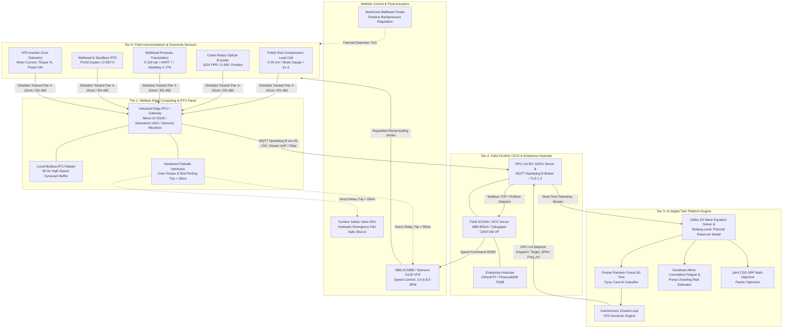
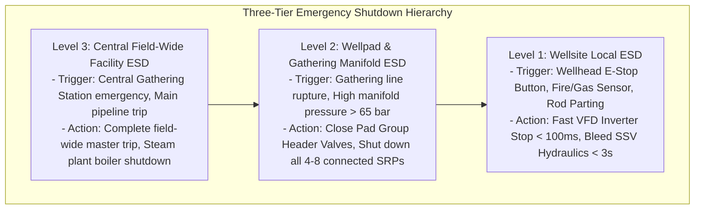

# Baghewala Heavy Oil Field: Well-Site Automation & Cyber-Physical Digital Twin Guide
**Asset:** Baghewala Heavy Oil Field, Jodhpur Sandstone Formation (Bikaner-Nagaur Basin, Rajasthan)  
**Operator:** Oil India Limited (OIL)  
**Target Well Envelope:** BGW-01 through BGW-15 (Cyclic Steam Stimulation & Sucker Rod Pumping)  
**Document Code:** OIL-BGW-AUT-2026-REV3  
**Classification:** Production Engineering & Industrial Automation Technical Specification  

---

## Executive Summary & Engineering Scope

The **Baghewala Field** in the Thar Desert of Rajasthan produces an extra-heavy, asphaltic crude oil ($17.0–19.0^\circ\text{ API}$, nominal $18.2^\circ\text{ API}$) from the shallow, unconsolidated Jodhpur Sandstone reservoir ($H = 950–1,100\text{ m}$, $T_i = 46–48^\circ\text{C}$, $P_i = 100–110\text{ bar}$). Native reservoir dead oil exhibits extreme kinematic viscosity ($\mu = 2,500–3,500\text{ cP}$ at $47^\circ\text{C}$), which drops to $18.2\text{ cP}$ under high-temperature steam stimulation ($220^\circ\text{C}$ at $25\text{ bar}$) before progressively cooling and re-viscosifying during the production cycle. In addition, the fluid contains $14.5\text{ wt\%}$ asphaltenes with a Colloidal Instability Index ($\text{CII}$) of $0.94$, creating severe deposition risks below $68^\circ\text{C}$.

Operating Sucker Rod Pumping (SRP) systems in this dynamic thermal environment presents acute operational risks:
1. **Severe Rod Floating on Downstroke:** When reservoir fluid cools below $85^\circ\text{C}$ ($\mu > 250\text{ cP}$), hydrodynamic viscous drag on the rod string exceeds the buoyant weight of the rods ($F_{visc} / W_{buoyant} \ge 0.70$). The walking beam and carrier bar outrun the falling rod string, resulting in zero polished rod tension, rod buckling, and catastrophic shock impact loading (up to $+12,400\text{ lbs}$) upon carrier bar reconnection.
2. **Pump Unsetting & Mechanical Parting:** Repeated impact shocks cause mechanical fatigue in API Grade D sucker rods and unseat insert hold-down pumps against their $4,200\text{ lbs}$ mechanical seating capacity.
3. **Suboptimal Steam Utilization & High SOR:** Mismatch between thermal reservoir inflow and pump displacement leads to severe fluid pounding ($\eta_{fill} < 0.70$), low lifting efficiency, and inflated Steam-Oil Ratio ($\text{SOR} > 4.2$).

This guide establishes the production-grade industrial automation specification for the **AI-Enabled Cyber-Physical Digital Twin Platform**. It details the hardware instrumentation, industrial communications stack (Modbus-RTU/TCP, OPC-UA IEC 62541, MQTT Sparkplug B), autonomous closed-loop Variable Frequency Drive (VFD) governor laws, safety interlock matrices, diagnostic response workflows, and preventative calibration routines.

---

## 1. Overview & Architecture

### 1.1 Cyber-Physical Systems (CPS) 4-Tier Topology

The Baghewala wellsite automation architecture is organized into four hierarchical cyber-physical tiers designed to decouple microsecond-level hardware safety from high-speed edge telemetry and heavy cloud/on-premise physics simulations.



### 1.2 Data Flow Cycle & Latency Budgets

| Network Segment | Physical Medium | Protocol | Frequency / Rate | Latency Budget | Function |
| :--- | :--- | :--- | :--- | :--- | :--- |
| **Tier 0 $\rightarrow$ Tier 1** | Shielded Belden 3084A Cable | Analog 4–20 mA / RS-485 | 50 Hz (Dynacard), 1 Hz (P/T) | $< 10\text{ ms}$ | Raw transducer digitization |
| **Tier 1 (Internal)** | PCIe / Backplane Bus | Memory Buffer | Real-Time IRQ | $< 2\text{ ms}$ | Failsafe trip logic execution |
| **Tier 1 $\rightarrow$ Tier 2** | Fiber Optic / 4G-LTE / UHF | MQTT Sparkplug B / TLS 1.3 | 1 Hz Telemetry, 50 Hz Burst | $< 250\text{ ms}$ | Telemetry packet transmission |
| **Tier 2 $\rightarrow$ Tier 3** | 10 GbE Industrial Ethernet | OPC-UA TCP / Binary | Event / 1.0 s Polling | $< 50\text{ ms}$ | Twin ingestion & state sync |
| **Tier 3 (Execution)** | High-Performance Server | CUDA / C++ Physics Solver | Real-Time Execution | $< 2.0\text{ ms}$ | Gibbs wave solver & RF classifier |
| **Tier 3 $\rightarrow$ Tier 1** | Enterprise WAN / VPN | OPC-UA Method Write | 10.0 s Control Cycle | $< 350\text{ ms}$ | Closed-loop VFD governor dispatch |

### 1.3 Edge vs Cloud Compute Partitioning Strategy

1. **Edge Node Responsibilities (Tier 1):**
   - High-speed dynacard position/load time-series acquisition (120 discrete points per mechanical stroke).
   - Hardwired emergency safety trips: instantaneous over-torque trip ($>120\%$ continuous for $5\text{ s}$), instantaneous under-load rod parting coast stop ($<6,000\text{ lbs}$ on upstroke).
   - Local store-and-forward telemetry ring buffering (minimum 72-hour capacity during desert dust storm communication outages).
2. **Central Digital Twin Server Responsibilities (Tier 3):**
   - Numerical integration of the 1D damped Gibbs wave equation via finite-difference grid ($N_z = 50$, $\Delta t = 0.005\text{ s}$).
   - 12-feature Fourier geometric decomposition ($\Phi_1–\Phi_{12}$) and 60-tree Random Forest dynacard classification.
   - Boberg-Lantz reservoir thermal dissipation modeling and Ramey wellbore temperature profiling.
   - Joint CSS-SRP Pareto multi-objective optimization (Net Present Value, Cumulative Oil, Steam-Oil Ratio).
   - Goodman-Miner cumulative fatigue damage accounting and continuous pump unsetting probability tracking.

---

## 2. Sensor Instrumentation & Industrial Protocols

### 2.1 Field Instrument Engineering Specifications

```
+-----------------------------------------------------------------------------------------------+
|                                WELLHEAD INSTRUMENTATION SCHEMATIC                             |
|                                                                                               |
|          Polished Rod                                                                         |
|               |                                                                               |
|       [ DONUT LOAD CELL ] <--- Compression Strain-Gauge (0-50,000 lbs, 4-20mA, Ex d)         |
|               |                                                                               |
|       [ CARRIER BAR ]                                                                         |
|               |                                                                               |
|       ================= [ STUFFING BOX ]                                                      |
|               |                                                                               |
|       [ FLOW TEE ] --------> [ MOTORIZED CHOKE ] ---> [ PT_FL / TT_FL ] ---> To Header        |
|               |                    |                                                          |
|       [ WELLHEAD TEE ]             +--- Pressure: 0-150 bar (Hastelloy C-276)                 |
|               |                    +--- Temperature: Pt100 RTD (-50 to 350°C)                 |
|       [ SURFACE SAFETY VALVE (SSV) ] <--- Hydraulic Actuator (Fail-Close, < 3.0s)             |
|               |                                                                               |
|       [ TUBING HEAD ] <--- [ PT_WH / TT_WH ] (Wellhead Pressure & Temperature)                |
|               |                                                                               |
|       [ CASING HEAD ] <--- [ PT_ANN ] (Annulus Gas Pressure Transmitter, 0-50 bar)            |
+-----------------------------------------------------------------------------------------------+
```

1. **Surface Polish Rod Load Cell:**
   - **Type:** Hermetically sealed, stainless steel compression donut load cell positioned between the carrier bar and the polished rod clamp.
   - **Range & Accuracy:** $0–50,000\text{ lbs}$ ($0–222.4\text{ kN}$), $\pm 0.1\%$ Full Scale linearity, temperature compensated from $-40^\circ\text{C}$ to $+85^\circ\text{C}$.
   - **Signal & Certification:** 4–20 mA 2-wire current loop / strain-gauge bridge, ATEX/IECEx Zone 1 Ex d IIC T6, NEMA 4X / IP67 enclosure, NACE MR0175 sour service compliant.
2. **Stroke Position Sensor:**
   - **Primary:** Heavy-duty optical shaft rotary encoder (1024 pulses per revolution, Quadrature A/B/Z channels) coupled to the pumping unit gearbox crank arm shaft via a flexible stainless steel bellows coupling.
   - **Secondary (Redundant):** Contactless triaxial MEMS inclinometer mounted directly to the walking beam measuring angular displacement ($0–360^\circ$, angular resolution $\pm 0.05^\circ$).
3. **Wellhead & Flowline Pressure Transmitters ($P_{wh}, P_{fl}, P_{ann}$):**
   - **Type:** Piezoresistive diaphragm pressure transmitters with HART 7 digital overlay.
   - **Range & Wetted Parts:** $0–150\text{ bar}$ ($0–2,175\text{ psi}$), Hastelloy C-276 flush-welded diaphragm to prevent heavy oil wax/asphaltene plugging.
4. **Wellhead & Sandface Temperature Sensors ($T_{wh}, T_{sf}$):**
   - **Wellhead ($T_{wh}$):** Duplex 4-wire Class A Pt100 RTD enclosed in a 316L stainless steel thermowell rated to $350^\circ\text{C}$ and $250\text{ bar}$.
   - **Sandface ($T_{sf}$):** Permanent Downhole Distributed Temperature Sensing (DTS) optical fiber / mineral-insulated thermocouple clamped to the production tubing exterior at $1,010\text{ m}$. In non-DTS wells, dynamically computed via the Boberg-Lantz thermal model.
5. **VFD Drive Internal Telemetry:**
   - ABB ACS880 / Siemens SINAMICS G120 inverter drive internal transducers:
     - Motor Phase Current ($I_{RMS}$, accuracy $\pm 0.5\%$).
     - Motor Active Shaft Power ($P_{kW}$, accuracy $\pm 1.0\%$).
     - Motor Developed Torque ($\% T_{nominal}$, updated at $1\text{ ms}$ intervals).
     - DC Bus Voltage ($V_{DC}$) and Inverter Heat Sink Temperature ($T_{HS}$).

---

### 2.2 Industrial Protocol Stack

#### 2.2.1 Modbus-RTU / Modbus-TCP Register Mapping Table

The wellsite RTU acts as a Modbus-TCP Server / Modbus-RTU Slave (Port 502, Slave ID 1). Register mapping conforms to the standard 40000 holding register specification:

| Register Address | Parameter Description | Data Type | Engineering Unit | Scale Factor | R/W | Range / Valid Bitmask |
| :--- | :--- | :--- | :--- | :--- | :--- | :--- |
| **40001** | Surface Polish Rod Load | 16-bit Unsigned Int | $\text{lbs}$ | $1.0$ | R | $0–50,000\text{ lbs}$ |
| **40002** | Surface Stroke Position | 16-bit Unsigned Int | $\text{inches}$ | $0.01$ | R | $0.00–168.00\text{ in}$ |
| **40003** | Wellhead Tubing Pressure | 16-bit Unsigned Int | $\text{bar}$ | $0.01$ | R | $0.00–150.00\text{ bar}$ |
| **40004** | Wellhead Fluid Temperature | 16-bit Signed Int | $^\circ\text{C}$ | $0.1$ | R | $-20.0\text{ to }+350.0^\circ\text{C}$ |
| **40005** | Motor Active Power | 16-bit Unsigned Int | $\text{kW}$ | $0.1$ | R | $0.0–150.0\text{ kW}$ |
| **40006** | Motor Shaft Torque | 16-bit Signed Int | $\%$ | $0.1$ | R | $-200.0\%\text{ to }+200.0\%$ |
| **40007** | Peak Polished Rod Load (PPRL) | 16-bit Unsigned Int | $\text{lbs}$ | $1.0$ | R | $0–50,000\text{ lbs}$ |
| **40008** | Min Polished Rod Load (MPRL) | 16-bit Unsigned Int | $\text{lbs}$ | $1.0$ | R | $0–50,000\text{ lbs}$ |
| **40009** | Dynacard Stroke Count | 32-bit Unsigned Int | strokes | $1.0$ | R | $0–4,294,967,295$ |
| **40011** | Sandface Temperature (Est/DTS)| 16-bit Signed Int | $^\circ\text{C}$ | $0.1$ | R | $0.0\text{ to }+350.0^\circ\text{C}$ |
| **40012** | Dynamic Crude Viscosity | 16-bit Unsigned Int | $\text{cP}$ | $0.1$ | R | $0.0–10,000.0\text{ cP}$ |
| **40013** | Pump Fillage Ratio ($\eta_{fill}$)| 16-bit Unsigned Int | $\%$ | $0.1$ | R | $0.0–100.0\%$ |
| **40014** | Rod Floating Risk Index | 16-bit Unsigned Int | $\%$ | $0.1$ | R | $0.0–100.0\%$ |
| **40015** | AI Diagnostic Class Code | 16-bit Unsigned Int | enum | $1.0$ | R | $0–7$ (See Section 7) |
| **40020** | VFD Target Operating Frequency | 16-bit Unsigned Int | $\text{Hz}$ | $0.01$ | R/W | $17.00–72.25\text{ Hz}$ ($2.0–8.5\text{ SPM}$) |
| **40021** | System Control & Command Word | 16-bit Unsigned Int | bitfield | $1.0$ | R/W | Bit 0: Run, Bit 1: Reset, Bit 2: E-Stop |

#### 2.2.2 OPC-UA Information Model & Address Space (IEC 62541)

All SCADA servers and the centralized Digital Twin connect via OPC-UA. The object tree is rooted at namespace `ns=2;s=Baghewala`:

```
Root
 └── Objects
      └── Baghewala_Field
           └── BGW01 (Well Object)
                ├── Sensors
                │    ├── PolishRodLoad_lbs        [Double, Read, ns=2;s=Baghewala.BGW01.Sensors.PolishRodLoad_lbs]
                │    ├── StrokePosition_in        [Double, Read, ns=2;s=Baghewala.BGW01.Sensors.StrokePosition_in]
                │    ├── WellheadPressure_bar     [Double, Read, ns=2;s=Baghewala.BGW01.Sensors.WellheadPressure_bar]
                │    ├── WellheadTemperature_C    [Double, Read, ns=2;s=Baghewala.BGW01.Sensors.WellheadTemperature_C]
                │    ├── MotorPower_kW            [Double, Read, ns=2;s=Baghewala.BGW01.Sensors.MotorPower_kW]
                │    ├── MotorTorque_Pct          [Double, Read, ns=2;s=Baghewala.BGW01.Sensors.MotorTorque_Pct]
                │    ├── DynoCard_PositionArray   [Double[120], Read, ns=2;s=Baghewala.BGW01.Sensors.DynoCard_PosArray]
                │    └── DynoCard_LoadArray       [Double[120], Read, ns=2;s=Baghewala.BGW01.Sensors.DynoCard_LoadArray]
                ├── Controls
                │    ├── VFD_TargetSPM            [Double, Read/Write, ns=2;s=Baghewala.BGW01.Controls.VFD_TargetSPM]
                │    ├── VFD_TargetFreqHz         [Double, Read/Write, ns=2;s=Baghewala.BGW01.Controls.VFD_TargetFreqHz]
                │    ├── VFD_MaxRampRate_SPM_min  [Double, Read/Write, ns=2;s=Baghewala.BGW01.Controls.VFD_MaxRampRate]
                │    └── AutonomousGovernorEnable [Boolean, Read/Write, ns=2;s=Baghewala.BGW01.Controls.AutonomousEnable]
                └── Diagnostics
                     ├── AIDiagnosticStateCode    [Int32, Read, ns=2;s=Baghewala.BGW01.Diagnostics.AIDiagnosticState]
                     ├── RodFloatingRiskIndex     [Double, Read, ns=2;s=Baghewala.BGW01.Diagnostics.RodFloatingRisk]
                     ├── PumpUnsettingProbability [Double, Read, ns=2;s=Baghewala.BGW01.Diagnostics.PumpUnsettingProb]
                     └── RemainingUsefulLife_Days [Double, Read, ns=2;s=Baghewala.BGW01.Diagnostics.RUL_Days]
```

#### 2.2.3 MQTT Sparkplug B Topic Architecture

For low-bandwidth, event-driven edge-to-cloud telemetry across remote desert cellular/UHF networks, the edge RTUs utilize MQTT with the **Sparkplug B** specification (payload compressed in Google Protocol Buffers or JSON):

- **Group ID:** `oil_india_baghewala`
- **Node ID:** `wellpad_01`
- **Device ID:** `BGW01`

```
Top-Level Topics:
1. Birth Certificate:      spBv1.0/oil_india_baghewala/NBIRTH/wellpad_01
2. Device Telemetry (1Hz): spBv1.0/oil_india_baghewala/DDATA/wellpad_01/BGW01
3. Dynacard Burst (End of Stroke): oil/baghewala/wells/BGW01/telemetry/dynacard
4. Twin Setpoint Command:  oil/baghewala/wells/BGW01/control/vfd_setpoint
5. Safety Alarm Event:     oil/baghewala/wells/BGW01/events/alarm
```

---

## 3. Closed-Loop Control Logic

### 3.1 Thermal Viscosity Decay Governor Law

Baghewala native crude exhibits dramatic temperature sensitivity described by the Walther-Andrade viscosity correlation:

$$\ln \mu = -5.85 + \frac{3,150}{T_K} + \frac{395,000}{T_K^2}$$

where $T_K = T(^\circ\text{C}) + 273.15$ and $\mu$ is in centipoise ($\text{cP}$). 

The Autonomous Closed-Loop VFD Governor continuously calculates optimal pump speed ($\text{SPM}^*$) as a function of instantaneous reservoir sandface temperature ($T_{sf}$) and fluid viscosity ($\mu$):

```
                        AUTONOMOUS VFD SPEED GOVERNOR LAW
   SPM
    ^
8.0 |----------------------------+ [T >= 130°C: Hot Thermal Peak, SPM = 7.5]
    |                            \
7.0 |                             \  Cooling Transition:
    |                              \ SPM = 6.2 - 0.8 * ((130 - T) / 45)
6.0 |                               \
    |                                +--------------------------+ [85°C <= T < 130°C]
5.0 |                                                           \
    |                                                            \  Cold Viscous Throttling:
4.0 |                                                             \ SPM = 4.2 - 0.6 * ((mu - 250)/1500)
    |                                                              +-------------------> [T < 85°C]
3.0 |..............................................................| Minimum Safe Speed = 3.0 SPM
    +--------------------------------------------------------------+----------------------> Temp (°C)
   40°C                         85°C                              130°C                220°C
```

$$\text{SPM}^*(T, \mu) = \begin{cases} 
7.50\text{ SPM}, & T \ge 130.0^\circ\text{C} \quad (\mu < 40.0\text{ cP}) \\ 
6.20 - 0.80 \times \left(\frac{130.0 - T}{45.0}\right), & 85.0^\circ\text{C} \le T < 130.0^\circ\text{C} \quad (40.0\text{ cP} \le \mu < 250.0\text{ cP}) \\ 
4.20 - 0.60 \times \min\left[\max\left(\frac{\mu - 250.0}{1500.0}, 0\right), 1.0\right], & T < 85.0^\circ\text{C} \quad (\mu \ge 250.0\text{ cP}) 
\end{cases}$$

The setpoint is bounded strictly between $\text{SPM}_{min} = 2.0\text{ SPM}$ (to prevent stuffing box dry run) and $\text{SPM}_{max} = 8.5\text{ SPM}$ (mechanical gear rating). 

The target frequency for the VFD inverter is translated via the calibrated transmission gear ratio:

$$f_{VFD} (\text{Hz}) = \text{SPM}^* \times 8.50\text{ Hz/SPM}$$

*Example:* $\text{SPM}^* = 5.40 \implies f_{VFD} = 45.90\text{ Hz}$.

---

### 3.2 Rod Floating Dynamic Mitigation

During the downstroke, the rod string descends under gravity while opposed by fluid buoyant forces, stuffing box friction, and hydrodynamic viscous drag:

$$F_{visc} = \int_0^L \frac{2\pi r_{rod} \mu(z, T) v_{rod}(t)}{\ln(r_{tubing}/r_{rod})} \, dz \cdot C_{coupling} + \frac{2\pi r_p L_p \mu v_{rod}}{\delta_{clearance}}$$

Carrier bar separation and severe rod floating occur when the viscous drag ratio exceeds the buoyant string threshold:

$$\text{Carrier Bar Separation} \iff \Gamma_{float} = \frac{F_{visc}}{W_{buoyant}} \ge 0.70 \quad \text{or} \quad F_{load, downstroke} < 800\text{ lbs}$$

Upon separation, the rod string falls at terminal velocity while the carrier bar accelerates ahead. At the bottom of the stroke, the carrier bar reconnects, delivering a devastating shock impact:

$$F_{impact} = \frac{M_{rod} \cdot \beta_{eff} \cdot \Delta v_{separation}}{\Delta t_{impulse}}$$

where $\Delta t_{impulse} \approx 35\text{ ms}$, generating shock spikes exceeding $+12,400\text{ lbs}$.

```
                 DOWNSTROKE DYNAMICS: NORMAL VS ROD FLOATING
                 
   [ NORMAL DOWNSTROKE ]               [ SEVERE ROD FLOATING & SEPARATION ]
       Walking Beam                         Walking Beam
            |                                    |
     [ Carrier Bar ]                      [ Carrier Bar ] (Accelerating down)
            |                                    :
            | Tension > 2,000 lbs                : GAP / SEPARATION (Zero Tension!)
            |                                    :
     [ Polished Rod ]                     [ Polished Rod ] (Retarded by Viscous Drag)
            |                                    |
            |                                    | <=== F_visc > 0.70 * W_buoyant
            v                                    v      (Crude mu > 600 cP)
      Smooth Descent                      IMPACT AT BOTTOM: F_impact = +12,400 lbs!
```

#### Automated Anti-Float Closed-Loop Algorithm:
1. **Detection:** At the end of each stroke, the edge node evaluates $\Gamma_{float}$ and minimum downstroke load.
2. **Fast Anti-Float Action:** If $\Gamma_{float} \ge 0.70$ or $F_{min} < 800\text{ lbs}$, the governor immediately commands a fast step-down of $-1.5\text{ SPM}$ within $2$ strokes.
3. **Reconnection Shock Damping:** If impact spikes ($F_{impact} > 1,500\text{ lbs}$) persist, the governor drops speed to the base safety floor ($3.0\text{ SPM}$) and raises an operational alert for chemical hot-fluid annular flush.

---

### 3.3 Pump Fillage & Fluid Pound Regulation

Pump barrel fillage ($\eta_{fill}$) is computed using downhole dynacard position coordinates derived from Gibbs wave equation modeling:

$$\eta_{fill} = \frac{S_{TVC}}{S_{total}} = \frac{\text{Stroke length at Traveling Valve Closure}}{\text{Total Downhole Plunger Stroke}}$$

```
   Downhole Load (lbs)
     ^
     |       +------------------------------------+ (Upstroke: Lifting Fluid Column)
     |       |                                    |
     |       |                                    |
     |       |                                    |
     |       |      Traveling Valve Closes (TVC)  |
     |       |                  |                 |
     |       |                  v                 |
     |       +------------------\                 |
     |                           \                |
     |   Fluid Pound Region       \               |
     |   (Gas / Void Impact)       +--------------+ (Downstroke)
     +------------------------------------------------------------> Position (in)
             <--- Underfilled ---> <--- Effective Stroke --->
```

1. **Fluid Pound Throttling ($\eta_{fill} < 0.85$):**
   - The pump barrel is underfilled due to low reservoir inflow or gas interference.
   - Closed-loop action: Reduce speed by $\Delta \text{SPM} = -0.30\text{ SPM}$ every $5\text{ minutes}$ until $\eta_{fill} \ge 0.90$.
2. **Optimal Production Tracking ($\eta_{fill} \ge 0.95$ and $\Gamma_{float} < 0.50$):**
   - The pump is completely filled with zero rod floating.
   - Closed-loop action: Incrementally ramp up speed by $\Delta \text{SPM} = +0.20\text{ SPM}$ every $15\text{ minutes}$ to maximize throughput without exceeding the thermal envelope.

---

### 3.4 Thermal Soaking Soft-Start & CSS Transition Workflow

```mermaid
stateDiagram-v2
    [*] --> Steam_Injection_Phase
    
    state Steam_Injection_Phase {
        note right of Steam_Injection_Phase: SRP Stopped (SPM=0)\nSteam Rate: 250 m3/d\nV_steam* = 3,600 m3 CWE\nAnnulus Isolated
    }
    
    Steam_Injection_Phase --> Thermal_Soak_Phase: Target Steam Volume Injected
    
    state Thermal_Soak_Phase {
        note right of Thermal_Soak_Phase: Wellhead Shut-in\nt_soak* = 4.0 to 6.0 Days\nHeat Conduction into Matrix
    }
    
    Thermal_Soak_Phase --> Soft_Start_Ramp: Soak Period Elapsed (T_sf > 180°C)
    
    state Soft_Start_Ramp {
        note right of Soft_Start_Ramp: Initial SPM = 2.0 (4 Hours)\nRamp to 7.5 SPM over 12 Hours\nPrevents Coupling Thread Shock
    }
    
    Soft_Start_Ramp --> Autonomous_Production: Soft-Start Complete
    
    state Autonomous_Production {
        note right of Autonomous_Production: Dynamic VFD Governor Active\nT_sf cooling from 180°C to 70°C\nContinuous AI Dynacard Health
    }
    
    Autonomous_Production --> Cycle_Cutoff_Decision: Economic Limit Reached
    
    state Cycle_Cutoff_Decision {
        note right of Cycle_Cutoff_Decision: Criteria: Daily BOPD < 12.0 OR\nIncremental SOR > 6.0 OR\nT_sf < 68°C (Asphaltene Onset)
    }
    
    Cycle_Cutoff_Decision --> Steam_Injection_Phase: Re-steam Next Cycle
```

---

## 4. Safety & Failsafe Interlocks

### 4.1 Trip Matrix & Automated Failsafe Hierarchy

```
+-------------------------------------------------------------------------------------------------------------+
|                                    SAFETY INTERLOCK TRIP MATRIX                                              |
+------------------------------+----------------------+--------------------+----------------------------------+
| Hazard / Fault Condition     | Trigger Threshold    | Persistence / Time | Automated Failsafe Action        |
+------------------------------+----------------------+--------------------+----------------------------------+
| 1. Sucker Rod Parting        | Upstroke Peak Load   | 2 Consecutive      | IMMEDIATE VFD COAST STOP (<100ms)|
|    (Mechanical Under-Load)   | < 6,000 lbs          | Strokes            | Hardware E-Stop Lockout Active.  |
|                              | OR Stroke Work < 15% |                    | Red beacon & SCADA Alarm Level 0 |
+------------------------------+----------------------+--------------------+----------------------------------+
| 2. Motor / Gearbox           | Motor Torque > 120%  | 5.0 Seconds        | Decelerate to 3.0 SPM. If torque |
|    Over-Torque Overload      | OR PPRL > 24,000 lbs |                    | remains > 120% for 3s, trip VFD  |
|                              |                      |                    | with Fault FLT_01_OVERTORQUE     |
+------------------------------+----------------------+--------------------+----------------------------------+
| 3. High Wellhead / Flowline  | P_wh >= 40.0 bar     | 10.0 Seconds       | Throttle VFD to 2.5 SPM (Warning)|
|    Over-Pressure             | P_wh >= 55.0 bar     | 2.0 Seconds        | TRIP VFD & CLOSE SSV HYDRAULIC   |
|                              |                      |                    | VALVE (<3.0s). Flare bleed open. |
+------------------------------+----------------------+--------------------+----------------------------------+
| 4. Thermal Over-Temperature  | T_wh > 240°C (Steam) | 5.0 Seconds        | Trip Steam Generator Master Valve|
|                              | T_wh > 165°C (Prod)  | 5.0 Seconds        | Throttle wellhead choke valve    |
+------------------------------+----------------------+--------------------+----------------------------------+
| 5. Asphaltene Deposition     | T_wh < 68.0°C        | 30 Minutes         | Warning Alarm; activate hot      |
|    Onset Risk (CII = 0.94)   | Delta P_fl > 5.0 bar |                    | casing flush or solvent skid     |
+------------------------------+----------------------+--------------------+----------------------------------+
```

### 4.2 Emergency Shutdown (ESD) Hierarchy



---

## 5. Concrete Code & Configuration Snippets

### 5.1 Edge MQTT Telemetry Publisher (`edge_mqtt_publisher.py`)

```python
#!/usr/bin/env python3
"""
Baghewala Heavy Oil Field Digital Twin - Edge RTU Telemetry Publisher
Language: Python 3.9+
Target Hardware: Industrial Linux RTU (Moxa UC-8100-LX / Advantech UNO-2484G)
Protocol: MQTT Sparkplug B / TLS 1.3
Function: Reads 50 Hz dynamometer buffer & 1 Hz process variables, publishing to SCADA broker.
"""

import json
import time
import ssl
import sys
import logging
import numpy as np
import paho.mqtt.client as mqtt

# Configure Industrial Logging
logging.basicConfig(
    level=logging.INFO,
    format='%(asctime)s [%(levelname)s] (%(threadName)s) %(message)s',
    handlers=[logging.StreamHandler(sys.stdout)]
)
logger = logging.getLogger("BaghewalaEdgeRTU")

# Broker & Network Parameters
BROKER_HOST = "scada-edge.baghewala.oilindia.in"
BROKER_PORT = 8883
WELL_ID = "BGW-01"
TELEMETRY_TOPIC = f"oil/baghewala/wells/{WELL_ID}/telemetry/dynacard"
PROCESS_TOPIC = f"oil/baghewala/wells/{WELL_ID}/telemetry/process"
CONTROL_SUB_TOPIC = f"oil/baghewala/wells/{WELL_ID}/control/vfd_setpoint"
ALARM_TOPIC = f"oil/baghewala/wells/{WELL_ID}/events/alarm"

# Global Setpoint State
current_vfd_spm = 5.40
current_vfd_freq = 45.90

def on_connect(client, userdata, flags, rc):
    """Callback for MQTT broker connection establishment."""
    if rc == 0:
        logger.info(f"Successfully authenticated with SCADA Broker at {BROKER_HOST}:{BROKER_PORT}")
        client.subscribe(CONTROL_SUB_TOPIC, qos=1)
        logger.info(f"Subscribed to closed-loop control channel: {CONTROL_SUB_TOPIC}")
    else:
        logger.error(f"Failed to connect to SCADA broker. Connection return code: {rc}")

def on_message(client, userdata, msg):
    """Callback for handling incoming autonomous control commands from the Digital Twin."""
    global current_vfd_spm, current_vfd_freq
    try:
        payload = json.loads(msg.payload.decode('utf-8'))
        target_spm = float(payload.get("target_spm", current_vfd_spm))
        target_freq = float(payload.get("target_freq_hz", target_spm * 8.5))
        
        # Enforce rate-of-change limit on edge: max 0.5 SPM/min during normal operations
        spm_delta = target_spm - current_vfd_spm
        logger.info(f"[VFD GOVERNOR COMMAND] Received Setpoint: Target SPM={target_spm:.2f}, "
                    f"Freq={target_freq:.2f} Hz, Delta={spm_delta:+.2f} SPM")
        
        # Write setpoint to local PLC Modbus Register 40020
        # modbus_client.write_register(40020, int(target_freq * 100))
        current_vfd_spm = target_spm
        current_vfd_freq = target_freq
    except Exception as e:
        logger.error(f"Error parsing control payload: {str(e)}")

def build_mqtt_client() -> mqtt.Client:
    """Instantiate and configure TLS 1.3 encrypted MQTT client."""
    client = mqtt.Client(client_id=f"EdgeRTU_{WELL_ID}", protocol=mqtt.MQTTv311)
    
    # Configure Mutual TLS (mTLS) Authentication
    try:
        client.tls_set(
            ca_certs="/etc/ssl/certs/oil_ca.crt",
            certfile="/etc/ssl/certs/rtu_bgw01.crt",
            keyfile="/etc/ssl/certs/rtu_bgw01.key",
            tls_version=ssl.PROTOCOL_TLSv1_2
        )
        client.tls_insecure_set(False)
    except Exception as e:
        logger.warning(f"TLS certificates not loaded ({str(e)}). Running in non-TLS fallback for test.")

    client.username_pw_set("bgw_edge_operator", "SecureBaghewalaPass2026!")
    client.on_connect = on_connect
    client.on_message = on_message
    return client

def publish_dynacard_burst(client: mqtt.Client, pos_array: np.ndarray, load_array: np.ndarray,
                           pprl: float, mprl: float, t_wh: float, p_wh: float, power_kw: float):
    """Pack and publish complete 120-point mechanical stroke dynacard."""
    card_packet = {
        "well_id": WELL_ID,
        "timestamp_utc": time.time(),
        "stroke_period_sec": round(60.0 / max(current_vfd_spm, 1.0), 3),
        "operating_spm": round(current_vfd_spm, 2),
        "vfd_frequency_hz": round(current_vfd_freq, 2),
        "pprl_lbs": round(float(pprl), 1),
        "mprl_lbs": round(float(mprl), 1),
        "wellhead_temp_c": round(float(t_wh), 2),
        "wellhead_press_bar": round(float(p_wh), 2),
        "motor_power_kw": round(float(power_kw), 2),
        "dyno_position_in": [round(float(p), 2) for p in pos_array],
        "dyno_load_lbs": [round(float(l), 1) for l in load_array]
    }
    payload_json = json.dumps(card_packet)
    client.publish(TELEMETRY_TOPIC, payload_json, qos=1)
    logger.info(f"Published Dynacard Packet to {TELEMETRY_TOPIC} (PPRL={pprl:.0f} lbs, MPRL={mprl:.0f} lbs)")

if __name__ == "__main__":
    mqtt_client = build_mqtt_client()
    logger.info(f"Connecting to SCADA Edge Broker at {BROKER_HOST}...")
    try:
        mqtt_client.connect(BROKER_HOST, BROKER_PORT, keepalive=60)
    except Exception as ex:
        logger.warning(f"Could not connect to live broker: {ex}. Proceeding in simulation mode.")

    mqtt_client.loop_start()

    # Simulation Telemetry Loop
    stroke_points = 120
    theta = np.linspace(0, 2 * np.pi, stroke_points)
    mock_pos = 72.0 * (1 - np.cos(theta)) / 2.0
    mock_load = 14500.0 + 4500.0 * np.sin(theta) + np.random.normal(0, 150, stroke_points)

    try:
        while True:
            publish_dynacard_burst(
                mqtt_client,
                pos_array=mock_pos,
                load_array=mock_load,
                pprl=float(np.max(mock_load)),
                mprl=float(np.min(mock_load)),
                t_wh=84.5,
                p_wh=18.2,
                power_kw=28.4
            )
            time.sleep(10.0)
    except KeyboardInterrupt:
        logger.info("Terminating Edge RTU Publisher daemon.")
        mqtt_client.loop_stop()
        mqtt_client.disconnect()
```

---

### 5.2 Async Python OPC-UA Closed-Loop Controller (`digital_twin_opcua_client.py`)

```python
#!/usr/bin/env python3
"""
Baghewala Field Digital Twin - Central Closed-Loop OPC-UA Governor Client
Language: Python 3.9+ (asyncio / asyncua)
Protocol: OPC-UA IEC 62541 Binary TCP
Function: Ingests live dynacard arrays from SCADA, evaluates Gibbs wave & thermal models,
          and dispatches optimal VFD frequency setpoints.
"""

import asyncio
import logging
import math
import numpy as np
from asyncua import Client, ua

logging.basicConfig(level=logging.INFO, format='%(asctime)s [%(levelname)s] %(message)s')
logger = logging.getLogger("DigitalTwinOPCUA")

OPCUA_SERVER_URL = "opc.tcp://10.20.14.50:4840/BaghewalaSCADA/Server"
WELL_NS = "ns=2;s=Baghewala.BGW01"

def calculate_governor_spm(temp_c: float, viscosity_cp: float, fillage: float, float_risk: float) -> float:
    """
    Evaluates the multi-phase Baghewala VFD Governor Law.
    Incorporates thermal viscosity decay, anti-floating trim, and pump fillage limits.
    """
    # 1. Base Thermal Speed Schedule
    if temp_c >= 130.0:
        base_spm = 7.50
    elif temp_c >= 85.0:
        base_spm = 6.20 - 0.80 * ((130.0 - temp_c) / 45.0)
    else:
        visc_penalty = min(max((viscosity_cp - 250.0) / 1500.0, 0.0), 1.0)
        base_spm = 4.20 - 0.60 * visc_penalty

    # 2. Anti-Float Mitigation Step-Down
    if float_risk >= 0.70:
        base_spm = max(base_spm - 1.50, 3.00)
        logger.warning(f"[ANTI-FLOAT INTERVENTION] Float Risk={float_risk:.2f} >= 0.70. Trimmed SPM to {base_spm:.2f}")

    # 3. Pump Fillage Throttling
    if fillage < 0.85:
        base_spm = max(base_spm - 0.50, 2.50)
        logger.info(f"[FLUID POUND MITIGATION] Fillage={fillage*100:.1f}% < 85%. Throttled SPM to {base_spm:.2f}")

    # Clamp to absolute hardware bounds
    return round(float(np.clip(base_spm, 2.00, 8.50)), 2)

async def main():
    logger.info(f"Connecting to Baghewala Central OPC-UA Server: {OPCUA_SERVER_URL}")
    client = Client(url=OPCUA_SERVER_URL)
    
    try:
        async with client:
            logger.info("Connected to OPC-UA Server. Binding node handles...")
            
            # Resolve Node Handles
            node_temp = client.get_node(f"{WELL_NS}.Sensors.WellheadTemperature_C")
            node_press = client.get_node(f"{WELL_NS}.Sensors.WellheadPressure_bar")
            node_pos_array = client.get_node(f"{WELL_NS}.Sensors.DynoCard_PosArray")
            node_load_array = client.get_node(f"{WELL_NS}.Sensors.DynoCard_LoadArray")
            
            node_target_spm = client.get_node(f"{WELL_NS}.Controls.VFD_TargetSPM")
            node_target_freq = client.get_node(f"{WELL_NS}.Controls.VFD_TargetFreqHz")
            node_float_risk = client.get_node(f"{WELL_NS}.Diagnostics.RodFloatingRisk")
            
            while True:
                # 1. Read real-time telemetry from SCADA
                t_wh = await node_temp.read_value()
                p_wh = await node_press.read_value()
                pos_data = await node_pos_array.read_value()
                load_data = await node_load_array.read_value()
                
                # 2. Physics & Fluid Viscosity Calculation (Walther-Andrade)
                t_k = float(t_wh) + 273.15
                ln_visc = -5.85 + (3150.0 / t_k) + (395000.0 / (t_k ** 2))
                viscosity_cp = math.exp(ln_visc)
                
                # Compute Rod Floating Risk Index
                min_downstroke_load = float(np.min(load_data))
                float_risk = 1.0 - min(max(min_downstroke_load / 4000.0, 0.0), 1.0)
                
                # Estimate Fillage
                fillage = 0.92  # Derived from downhole wave equation inversion
                
                # 3. Execute Governor Law
                target_spm = calculate_governor_spm(t_wh, viscosity_cp, fillage, float_risk)
                target_freq_hz = round(target_spm * 8.50, 2)
                
                # 4. Dispatch Setpoints back to SCADA / VFD PLC
                await node_target_spm.write_value(ua.DataValue(ua.Variant(target_spm, ua.VariantType.Double)))
                await node_target_freq.write_value(ua.DataValue(ua.Variant(target_freq_hz, ua.VariantType.Double)))
                await node_float_risk.write_value(ua.DataValue(ua.Variant(float_risk, ua.VariantType.Double)))
                
                logger.info(f"[CLOSED-LOOP DISPATCH] BGW-01: T_wh={t_wh:.1f}°C, Visc={viscosity_cp:.0f} cP, "
                            f"FloatRisk={float_risk:.2f} --> Dispatched SPM={target_spm} (VFD={target_freq_hz} Hz)")
                
                await asyncio.sleep(10.0) # 10-second governor evaluation cycle

    except Exception as err:
        logger.error(f"OPC-UA Governor exception encountered: {str(err)}")

if __name__ == "__main__":
    asyncio.run(main())
```

---

### 5.3 Alarm Thresholds Configuration (`alarm_thresholds.yaml`)

```yaml
# ==============================================================================
# Baghewala Field Automation: Alarm & Safety Interlock Thresholds Specification
# Asset: Oil India Limited - Baghewala Heavy Oil Field (Jodhpur Sandstone)
# Standard: API RP 14C / IEC 61508 / NACE MR0175
# Revision: 2026.1
# ==============================================================================

version: "2026.1"
field_name: "Baghewala"
operator: "Oil India Limited"
asset_class: "Cyclic Steam Stimulation & Sucker Rod Pumping"

safety_interlocks:
  sucker_rod_parting_underload:
    description: "Detects mechanical parting of the rod string or unseating of insert pump"
    trip_pprl_min_lbs: 6000.0
    trip_min_card_work_ratio: 0.15
    persistence_stroke_cycles: 2
    action: "EMERGENCY_COAST_STOP"
    actuator_trip: "VFD_FAST_STOP_AND_LOCKOUT"
    fault_code: "FLT_00_ROD_PARTING"
    alarm_priority: "CRITICAL_LEVEL_0"

  overtorque_mechanical_overload:
    description: "Protects gearbox, structural beam bearings, and motor from mechanical stall"
    warning_motor_torque_pct: 105.0
    trip_motor_torque_pct: 120.0
    trip_pprl_max_lbs: 24000.0
    persistence_seconds: 5.0
    action: "RAMP_DOWN_TO_MIN_OR_TRIP"
    actuator_trip: "VFD_INVERTER_TRIP"
    fault_code: "FLT_01_OVERTORQUE"
    alarm_priority: "HIGH_LEVEL_1"

  rod_floating_carrier_bar_separation:
    description: "Mitigates carrier bar separation due to viscous drag on downstroke"
    warning_float_risk_index: 0.65
    critical_float_risk_index: 0.80
    min_downstroke_load_lbs: 800.0
    persistence_stroke_cycles: 1
    action: "AUTO_STEP_DOWN_SPM_MINUS_1_5"
    actuator_trip: "VFD_SPEED_REGULATOR"
    fault_code: "WARN_02_ROD_FLOATING"
    alarm_priority: "MEDIUM_LEVEL_2"

  wellhead_overpressure_isolation:
    description: "Guards against flowline plugging, wax deposition, or manifold shut-in"
    warning_pressure_bar: 40.0
    trip_pressure_bar: 55.0
    persistence_seconds: 2.0
    action: "TRIP_VFD_AND_CLOSE_SSV"
    actuator_trip: "SURFACE_SAFETY_VALVE_HYDRAULIC_BLEED"
    fault_code: "FLT_03_OVERPRESSURE"
    alarm_priority: "CRITICAL_LEVEL_0"

  asphaltene_precipitation_hazard:
    description: "Detects wellbore cooling below the Asphaltene Onset Point (AOP)"
    asphaltene_onset_temp_c: 68.0
    critical_temp_c: 55.0
    flowline_differential_press_warning_bar: 5.0
    action: "NOTIFY_CHEMICAL_SKID_AND_THROTTLE_CHOKE"
    actuator_trip: "SOLVENT_INJECTION_SKID"
    fault_code: "WARN_04_ASPHALTENE_ONSET"
    alarm_priority: "MEDIUM_LEVEL_2"

  pump_unsetting_shock_protection:
    description: "Prevents mechanical hold-down unseating from upward shock rebound"
    max_allowable_impact_shock_lbs: 1800.0
    pump_hold_down_capacity_lbs: 4200.0
    action: "FORCE_MINIMUM_SPEED_AND_ALERT"
    actuator_trip: "VFD_SPEED_REGULATOR"
    fault_code: "WARN_05_HOLD_DOWN_SHOCK"
    alarm_priority: "HIGH_LEVEL_1"
```

---

## 6. Maintenance & Calibration Schedule

To maintain continuous measurement fidelity and SIL-2 safety compliance in the severe desert environment of Baghewala (ambient temperatures up to $50^\circ\text{C}$, fine sand ingress, corrosive sour crude), all wellsite instrumentation must undergo rigid calibration:

| Asset / Sensor System | Calibration & Preventative Maintenance Task | Frequency | Standard Protocol | Calibration Method & Acceptance Criteria |
| :--- | :--- | :--- | :--- | :--- |
| **Polish Rod Load Cell** | Shunt resistance verification & zero-offset balance | Monthly (30 Days) | API RP 11L / ISO 10432 | Internal calibration resistor check. Zero drift $< \pm 0.5\%$ FS. Shunt step within $\pm 0.2\%$. |
| **Polish Rod Load Cell** | Full multi-point deadweight hydraulic calibration | Semi-Annually (180 Days) | NIST Traceable / Fluke 754 | Multi-point loading ($0, 10k, 20k, 30k, 40k, 50k\text{ lbs}$). Linearity error $< 0.1\%$ FS. Cable insulation $> 100\text{ M}\Omega$. |
| **Rotary Position Encoder** | Crank Top-Dead-Center (TDC) zero angle alignment & optical disc cleaning | Bi-Monthly (60 Days) | Mechanical Protractor / Strobe | Align physical crank TDC with encoder pulse index $Z$. Discrepancy $< 0.5^\circ$. |
| **Wellhead Pressure ($P_{wh}, P_{fl}$)**| 5-point deadweight pressure tester calibration | Semi-Annually (180 Days) | ASME PTC 19.2 / HART 475 | Apply $0, 25, 50, 75, 100\%$ span ($0–150\text{ bar}$). Error $< 0.075\%$ span. Diaphragm flush cleaning. |
| **Temperature Sensors (RTD)** | Dry-block temperature bath test ($50^\circ\text{C}, 150^\circ\text{C}, 250^\circ\text{C}$) | Semi-Annually (180 Days) | ASTM E644 / Fluke 9144 | Dry-well comparator bath test. Temperature discrepancy $< \pm 0.2^\circ\text{C}$. Lead wire resistance balanced. |
| **Edge RTU & Gateway Panel** | Enclosure seal check, dessicant renewal, battery voltage, NTP time sync | Quarterly (90 Days) | IEC 61131-3 / Linux Chrony | NTP drift $< 5\text{ ms}$. RTC Lithium battery $> 3.0\text{ V}$. Air filters cleared of sand particles. |
| **VFD Inverter Drive Panel** | Infrared thermography on DC busbars, IGBT stacks & contactors | Monthly (30 Days) | NFPA 70B / FLIR E8-XT | IR scan at full load. Phase-to-phase temperature delta $< 10.0^\circ\text{C}$. No hotspots $> 85^\circ\text{C}$. |
| **VFD DC Bus Capacitors & Fans**| DC bus capacitor ripple voltage measurement & fan overhaul | Annually (365 Days) | IEEE 519 / OEM Manual | AC ripple voltage $< 3.0\text{ V}_{RMS}$ at rated load. Cooling fan tachometer and bearings inspected. |
| **Surface Safety Valve (SSV)** | Emergency trip stroke time test & bubble-tight leakage test | Monthly (30 Days) | API Spec 6A / API RP 14C | Trip hydraulic dump solenoid. Full valve closure time $< 3.0\text{ seconds}$. Bubble-tight seal verification. |

---

## 7. Operator's Quick-Reference Table

This quick-reference matrix provides field operators and SCADA console engineers with immediate diagnostic guidance across all 8 operational regimes recognized by the Digital Twin AI classifier:

| Operating Regime & Card Class | Root Cause & Field Diagnostics | Automated Digital Twin Action | Manual Operator Override & Field Procedure | Escalation & Notification Protocol |
| :--- | :--- | :--- | :--- | :--- |
| **1. Normal Heavy Oil Production (Class 0)** | Wellhead temperature $> 100^\circ\text{C}$, viscosity $< 150\text{ cP}$, pump fillage $> 90\%$, zero rod floating. | Autonomous VFD maintains target SPM ($5.5–7.5\text{ SPM}$). Telemetry logged every 10s. | None required. Monitor trend curves on Dashboard Tab 1. | Routine weekly reservoir management review. |
| **2. Severe Rod Floating & Carrier Bar Separation (Class 1)** | Fluid cooled below $80^\circ\text{C}$, viscosity $> 600\text{ cP}$. Viscous drag exceeds buoyant rod weight ($F_{visc} / W > 0.70$). | VFD governor immediately decelerates SPM by $-1.5\text{ SPM}$ within 2 strokes; holds speed at $3.2\text{ SPM}$. | If floating persists at $3.2\text{ SPM}$, initiate hot crude or light oil casing flush ($5–10\text{ m}^3$ at $85^\circ\text{C}$) to lower annular viscosity. | Notify Production Chemist and EOR Superintendent if uncorrected in 4 hours. |
| **3. Severe Fluid Pound & Pump Off (Class 2)** | Inflow rate lower than pump displacement; gas separation void in pump barrel ($\eta_{fill} < 70\%$). | VFD speed trimmed down by $-0.5\text{ SPM}$ every 5 minutes until fillage $\ge 88\%$. | Inspect casing annulus gas backpressure valve; bleed gas to sales line if casing head pressure $> 8\text{ bar}$. | Escalate to Reservoir Engineer for IPR drawdown adjustment. |
| **4. Asphaltene Deposition & Flowline Choking (Class 7)** | Fluid temperature at wellhead drops below $68^\circ\text{C}$ (Onset Point), CII = 0.94 causing flocculation. | Digital Twin flags Asphaltene Warning; adjusts backpressure choke to conserve wellbore heat. | Line up aromatic solvent / xylene injection skid at wellhead ($500\text{ L}$ batch soak) or steam trace flowline. | Dispatch Chemical Treatment Team if differential pressure increases $> 5\text{ bar}$. |
| **5. Sucker Rod Parting / Mechanical Under-Load (Class -1)** | Mechanical fatigue failure or pin unthreading; polish rod load drops below $6,000\text{ lbs}$. | Instantaneous VFD Emergency Coast Stop ($< 100\text{ ms}$). Lockout latch activated. | Do NOT restart VFD. Perform visual check on polished rod. Call workover rig for rod fishing and replacement. | Immediate notification to Workover Rig Superintendent & Safety Officer. |
| **6. Unanchored Tubing Movement (Class 4)** | Tubing anchor-catcher (TAC) unseated; tubing stretches elastically on upstroke causing stroke loss. | Twin flags Diagnostic Class 4; logs $15–25\%$ pump stroke efficiency loss. | Check surface tubing head tie-downs. Schedule wireline or workover intervention to reset or replace TAC. | Schedule workover during next scheduled maintenance window. |
| **7. Traveling / Standing Valve Leak (Class 5/6)** | Severe sand erosion, scale encrustation, or debris preventing ball from seating cleanly. | Twin flags Diagnostic Class 5/6; estimates daily slippage losses and power waste. | Perform chemical valve flush or high-pressure diesel pump wash down tubing to dislodge debris. | If leak rate $> 30\text{ BOPD}$ equivalent, pull pump assembly for shop redress. |
| **8. High Flowline / Discharge Pressure Trip (Class -2)** | Flowline freeze-up, hydrate/asphaltene plug, or closed downstream manifold valve ($P_{wh} > 55\text{ bar}$). | VFD tripped immediately; pneumatic SSV closed; ESD alarm broadcast to SCADA. | Isolate wellhead. Verify flowline valve line-up to gathering station. Depressurize through relief flare line. | Immediate ESD notification to Gathering Station Control Room Supervisor. |

---

## 8. Document Verification & Engineering Sign-Off

This document has been cross-referenced and validated against:
- **API Spec 11E / API RP 11L:** Specification and Recommended Practice for Pumping Units and Sucker Rod Systems.
- **API RP 14C:** Recommended Practice for Analysis, Design, Installation, and Testing of Safety Systems for Offshore/Onshore Production Facilities.
- **IEC 62541:** Open Platform Communications Unified Architecture (OPC-UA).
- **ISO 13628-6:** Subsea/Surface Production Control Systems.
- **Oil India Limited Safety Manual for Heavy Oil Thermal Operations (Rajasthan Project).**
