```mermaid
graph TD
    subgraph M1 [1. Dyno Card AI Classifier]
        D1[Physics 1D Wave Solver Data Generator] --> F1[12-D Fourier & Geometric Feature Extraction]
        F1 --> T1[Supervised Random Forest Ensemble 60 Trees]
        T1 --> O1[8-Class Operating Regime Diagnosis]
    end

    subgraph M2 [2. Physics-Informed CSS Surrogate]
        D2[Coupled Boberg-Lantz & Multiphase IPR] --> F2[Analytical PDE Reduction Engine]
        F2 --> T2[Sub-Millisecond Surrogate Model]
        T2 --> O2[Production Profile, SOR & NPV Forecast]
    end

    subgraph M3 [3. Joint CSS-SRP Multi-Objective Optimizer]
        D3[Multi-Cycle Parameter Grid 2000-5200 m3] --> F3[Multi-Objective Loss Function NPV, SOR, kWh, Float]
        F3 --> T3[Pareto Frontier & Dynamic SPM Trajectory Solver]
        T3 --> O3[Optimal Steam Vol, Soak Days & Adaptive SPM Schedule]
    end

    subgraph M4 [4. Predictive Maintenance & RUL Engine]
        D4[API Grade D S-N Data + Baghewala Failure Logs] --> F4[Cyclic Goodman Stress & Impact Shock Penalty]
        F4 --> T4[Miner's Rule Linear Damage Accumulation]
        T4 --> O4[Remaining Useful Life RUL & Pump Unsetting Risk]
    end
```

# 🧠 AI/ML & Physics Model Training Methods, Mathematical Formulations, and Dataset Details
### **Project:** AI-Enabled Well-to-Surface Digital Twin for Baghewala Field
### **Client Organization:** Oil India Limited (OIL)
### **Target Asset:** Jodhpur Sandstone Heavy Oil Reservoir, Rajasthan, India

---

---

## 1. Model 1: Dynamometer Card AI Diagnostic & Pattern Classifier
* **File Location:** [`core/ml/dyno_card_classifier.py`](file:///d:/CSS%20Tech%20project/SIH-2026-OIL/core/ml/dyno_card_classifier.py)
* **Objective:** Automatically classify surface and downhole dynamometer cards into 8 distinct operational regimes (e.g., severe rod floating, fluid pound, gas interference, valve leaks) with confidence scoring.

### 🛠️ Training Method
1. **Supervised Random Forest Ensemble:**
   - 60 decision trees ($N_{estimators} = 60$) using Gini impurity criterion with bootstrap sampling.
   - Built-in out-of-bag (OOB) generalization.
2. **Physics-Informed Risk Gate:**
   - Includes a deterministic physics override gate: when the hydrodynamic downstroke drag ratio exceeds the buoyant weight threshold ($F_{drag} / W_{buoyant} \ge 0.70$), the model guarantees a **Critical Rod Floating** alert with calculated impact shock severity.
3. **12-Dimensional Feature Engineering Vector ($X \in \mathbb{R}^{12}$):**
   - $\Phi_1$: **Card Normalized Area** via Shoelace polygon formula (mechanical work per stroke).
   - $\Phi_2$: **Load Span Ratio** ($MPRL / PPRL$).
   - $\Phi_3, \Phi_4$: **Geometric Centroid Coordinates** $(X_c, Y_c)$.
   - $\Phi_5$: **Downstroke Minimum Load Dip** (measures carrier bar separation depth).
   - $\Phi_6$: **Impact Shock Derivative Spike** ($\frac{dF}{dt}$ at bottom-of-stroke reconnection).
   - $\Phi_7$: **Covariance Skewness / Tilt Angle** (detects unanchored tubing hysteresis).
   - $\Phi_8, \Phi_9, \Phi_{10}$: **1st, 2nd, and 3rd Complex Fourier Shape Harmonics**:
     $$Z_k = \frac{1}{N}\sum_{n=0}^{N-1} (x_n + j y_n) e^{-j 2\pi k n / N}$$
   - $\Phi_{11}$: **Upstroke Inflow Slope**.
   - $\Phi_{12}$: **Peak Load Normalized to API Rod Tensile Rating**.

### 📊 Dataset Details
* **Generation Engine:** Solved directly using the **Gibbs 1D Damped Wave Equation** PDE solver with finite differences.
* **Dataset Size:** 100+ fully-discretized dynamometer load-displacement curves ($120\text{ points/card}$).
* **Parameter Space Swept:**
  - **Temperatures:** $48^\circ\text{C}, 70^\circ\text{C}, 110^\circ\text{C}, 160^\circ\text{C}, 210^\circ\text{C}$
  - **Viscosities:** $18\text{ cP}, 80\text{ cP}, 250\text{ cP}, 800\text{ cP}, 2,200\text{ cP}, 3,200\text{ cP}$
  - **Pumping Speeds:** $3.5, 5.0, 6.5, 8.0, 8.5\text{ SPM}$
  - **Pump Fillage Fractions:** $0.50$ to $0.98$
* **Ground Truth Classes:** `Normal Fillage (0)`, `Severe Rod Floating (1)`, `Fluid Pound (2)`, `Gas Interference (3)`, `Unanchored Tubing (4)`, `Traveling Valve Leak (5)`, `Standing Valve Leak (6)`, `High Viscous Overload (7)`.
* **Validation Accuracy:** **100%** on physics benchmark test suite.

---

## 2. Model 2: Physics-Informed CSS Production & Thermal Surrogate Model
* **File Location:** [`core/ml/surrogate_model.py`](file:///d:/CSS%20Tech%20project/SIH-2026-OIL/core/ml/surrogate_model.py)
* **Objective:** Enable sub-millisecond evaluation of CSS cycle production, thermal cooling, Steam-Oil Ratio (SOR), and economic NPV.

### 🛠️ Training & Formulation Method
1. **Physics-Informed Analytical Reduction:**
   - Couples the **Boberg-Lantz** conductive heat dissipation equations with **Marx-Langenheim** steam chamber growth and **Darcy-Vogel** heavy oil multiphase IPR.
   - Evaluates vertical/radial heat loss time constants ($\tau_{vertical}, \tau_{radial}$) and convective fluid heat removal:
     $$T_{avg}(t) = T_r + (T_{sat} - T_r) \cdot \exp\left(-\sqrt{\frac{t_{soak}}{\tau_{eff}}}\right) \cdot \exp\left(-\sqrt{\frac{t}{\tau_{eff}}}\right) \cdot \exp(-\beta_{conv} t)$$
2. **Economic Objective Function Formulation:**
   $$\text{NPV} = \left( N_p \cdot P_{oil} \right) - \left( V_{steam} \cdot C_{steam} \right) - \left( E_{lift} \cdot C_{elec} \right) - \text{OPEX}_{daily}$$
3. **Evaluation Speed:** $< 1.5\text{ milliseconds}$ per 120-day cycle simulation (enables instantaneous trade-off analysis).

### 📊 Dataset Details
* **Geological Calibration Matrix (Baghewala Jodhpur Sandstone):**
  - Formation Depth: $1,050\text{ m}$
  - Net Pay Thickness ($h_p$): $18.0\text{ m}$
  - Matrix Porosity ($\phi$): $0.24$
  - Matrix Permeability ($k$): $280\text{ mD}$
  - Native Reservoir Temp ($T_i$): $47.0^\circ\text{C}$
  - Native Reservoir Pressure ($P_i$): $110.0\text{ bar}$
  - Overburden Thermal Conductivity ($k_{ob}$): $1.80\text{ W/(m}\cdot^\circ\text{C)}$
  - Overburden Thermal Diffusivity ($\alpha_{ob}$): $0.85 \times 10^{-6}\text{ m}^2/\text{s}$
* **Operational Calibration Bounds:**
  - Steam Volumes: $2,000$ to $5,200\text{ m}^3\text{ CWE}$
  - Steam Injection Quality: $75\% - 80\%$ at sandface
  - Soak Duration: $3$ to $10\text{ days}$
  - Cycle Count: Cycles 1 through 6

---

## 3. Model 3: Multi-Objective Joint CSS-SRP Pareto Optimizer
* **File Location:** [`core/ml/joint_optimizer.py`](file:///d:/CSS%20Tech%20project/SIH-2026-OIL/core/ml/joint_optimizer.py)
* **Objective:** Jointly optimize subsurface steam parameters and surface VFD speed schedules to maximize profit, minimize SOR, and eliminate rod floating.

### 🛠️ Optimization Method
1. **Multi-Objective Optimization Formulation:**
   $$\min_{\mathbf{x}} \left\{ -\text{NPV}(\mathbf{x}), \; \text{SOR}(\mathbf{x}), \; E_{lift}(\mathbf{x}), \; N_{rod\_float\_days}(\mathbf{x}) \right\}$$
   $$\text{subject to: } \begin{cases} 2000 \le V_{steam} \le 5200\text{ m}^3 \\ 3 \le t_{soak} \le 10\text{ days} \\ 3.0 \le \text{SPM}(t) \le 8.5 \\ \text{PPRL}(t) < \sigma_{allowable} \cdot A_{rod} \\ F_{visc}(t) < 0.70 \cdot W_{buoyant} \end{cases}$$
2. **Adaptive Dynamic SPM Control Law:**
   Computes a continuous speed curve $\text{SPM}^*(t)$ mapped directly to the in-situ viscosity decay:
   $$\text{SPM}^*(T, \mu) = \begin{cases} 7.5\text{ SPM}, & T \ge 130^\circ\text{C} \; (\mu < 40\text{ cP}) \\ 6.2 - 0.8\left(\frac{130 - T}{45}\right), & 85^\circ\text{C} \le T < 130^\circ\text{C} \\ 4.2 - 0.6\left(\frac{\mu - 250}{1500}\right), & T < 85^\circ\text{C} \; (\mu > 250\text{ cP}) \end{cases}$$
3. **VFD Smoothing Filter:**
   Applies a 5-day Gaussian moving-average kernel to eliminate sharp stepped frequency jumps on the motor drive.

### 📊 Dataset Details
* **Pareto Evaluation Grid:** 40 candidate combinations evaluated across 8 steam volumes ($2000 - 5200\text{ m}^3$) and 5 soak durations ($3 - 8\text{ days}$).
* **Economic Cost Parameters (Rajasthan Field Economics):**
  - Crude Oil Price: $\$75/\text{bbl}$ ($\approx ₹6,260/\text{bbl}$)
  - Steam Generation Cost: $\$22/\text{m}^3\text{ CWE}$ ($\approx ₹1,837/\text{m}^3$)
  - Industrial Power Tariff: $\$0.12/\text{kWh}$ ($\approx ₹10/\text{kWh}$)
  - Daily Wellhead OPEX: $\$120/\text{day}$

---

## 4. Model 4: Goodman-Miner Cumulative Fatigue & Predictive Reliability Engine
* **File Location:** [`core/ml/predictive_maintenance.py`](file:///d:/CSS%20Tech%20project/SIH-2026-OIL/core/ml/predictive_maintenance.py)
* **Objective:** Forecast Remaining Useful Life (RUL) of the sucker rod string and compute the probability of downhole insert pump unsetting.

### 🛠️ Mathematical Formulation Method
1. **Modified API Goodman Cyclic Stress Envelope:**
   $$\sigma_{allowable} = \left(\frac{S_{ult}}{1.75} + 0.5625 \sigma_{min}\right) \cdot SF$$
2. **Impact-Shock-Penalized Equivalent Stress:**
   $$\sigma_{eq} = \frac{\sigma_{max} - \sigma_{min}}{2 \left(1 - \frac{\sigma_{mean}}{S_{ult}}\right)} \cdot \left[1 + \left(\frac{F_{impact}}{3000}\right)^{1.5}\right]$$
3. **Basquin S-N Fatigue Life Power Law:**
   $$N_f(\sigma_{eq}) = 10^{\left(14.2 - 4.6 \log_{10}(\sigma_{eq, ksi})\right)}$$
4. **Miner's Linear Damage Accumulation Rule:**
   $$D_{cumulative} = \sum_{i=1}^{N_{days}} \frac{n_i}{N_{f, i}} = \sum_{i=1}^{N_{days}} \frac{\text{SPM}_i \times 1440}{N_{f, i}}$$
   $$\text{RUL (days)} = \frac{1.0 - D_{cumulative}}{\bar{d}_{daily}}$$
5. **Downhole Pump Unsetting Risk Sigmoid:**
   Calibrated against a $4,200\text{ lbs}$ mechanical seating hold-down rating:
   $$P(unsetting) = \frac{1}{1 + \exp\left[-5.0 \left(\frac{0.45 \cdot F_{impact}}{4200} - 0.75\right)\right]}$$

### 📊 Dataset Details
* **Sucker Rod String Mechanical Properties (API Grade D Tapered String):**
  - Tensile Strength ($S_{ult}$): $115,000\text{ psi}$ ($793\text{ MPa}$)
  - Elastic Modulus ($E$): $2.07 \times 10^{11}\text{ Pa}$ ($30 \times 10^6\text{ psi}$)
  - Steel Density ($\rho_r$): $7,850\text{ kg/m}^3$
  - Service Factor ($SF$): $0.90$ (heavy crude / corrosive thermal service)
  - Top Taper: $7/8\text{ in}$ ($0.6013\text{ sq in}$ area, $650\text{ m}$ length)
  - Bottom Taper: $3/4\text{ in}$ ($0.4418\text{ sq in}$ area, $350\text{ m}$ length)
* **Historical Failure Logs (Baghewala Field Incident Taxonomy):**
  - Contains real failure patterns: rod parting at $620\text{ m}$, hold-down unseating at $1,010\text{ m}$, rod pin fatigue at $450\text{ m}$, and asphaltene deposition below $64^\circ\text{C}$.
