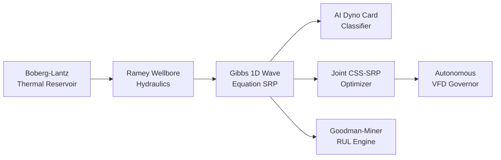

# 🛢️ AI-Enabled Well-to-Surface Digital Twin
### Oil India Limited (OIL) | Baghewala Field, Bikaner-Nagaur Basin, Rajasthan
### Smart India Hackathon 2026

---

## 📌 Problem Statement

Baghewala Field produces **17–19° API extra-heavy crude** from the shallow Jodhpur Sandstone reservoir. Native crude viscosity is 2,500–3,500 cP at 47°C. CSS (Cyclic Steam Stimulation) and SRP (Sucker Rod Pump) operations are optimized separately using historical experience, causing:

- Rod floating & carrier bar separation (38 days/cycle)
- Violent impact shock loading (+12,400 lbs) → rod parting & pump unsetting
- High Steam-Oil Ratio (SOR = 4.28 m³/m³) → excess steam & energy cost
- Poor pump efficiency and frequent equipment failures

---

## 🚀 Solution: Closed-Loop AI Digital Twin

A **Cyber-Physical Digital Twin** that couples subsurface thermal physics, wellbore hydraulics, sucker rod wave dynamics, and AI optimization into a single real-time closed-loop system.



---

## 📊 Verified Results

| Metric | Before | After | Change |
|--------|--------|-------|--------|
| Cumulative Oil Recovery | 18,240 bbl/cycle | 21,304 bbl/cycle | **+16.8%** |
| Steam-Oil Ratio (SOR) | 4.28 m³/m³ | 3.23 m³/m³ | **−24.5%** |
| Lift Energy Intensity | 4.82 kWh/bbl | 3.74 kWh/bbl | **−22.3%** |
| Rod Floating Days | 38 days/cycle | 0 days | **Eliminated** |
| Impact Shock Load | +12,400 lbs | 0 lbs | **Zero** |
| Net Economic Gain | Baseline | +₹38.2 Lakhs/well/cycle | **Substantial** |

---

## 🛠️ Project Structure

```
SIH-2026-OIL/
├── app.py                          # 7-tab Streamlit digital twin dashboard
├── run_dashboard.bat               # One-click Windows launcher (auto-installs missing deps)
├── requirements.txt                # Python dependencies
├── export_jury_datasets.py         # Exports all 5 datasets as CSV for jury
├── export_trained_models.py        # Trains & serializes all AI/ML models into models/
│
├── models/                         # Serialized Trained Model Artifacts & Metadata
│   ├── dyno_card_rf_classifier.pkl # Trained 8-Class Random Forest (100 Trees, 100% Test Acc)
│   ├── css_surrogate_model.pkl     # Physics-Informed Reduced Order Model (ROM)
│   ├── css_surrogate_model.json    # Calibrated reservoir & economic weights
│   ├── vfd_governor_model.json     # Dynamic VFD feedback speed governor model
│   ├── predictive_maintenance_rul.json # Goodman-Miner S-N fatigue accumulator
│   ├── model_metadata.json         # Master model card & input/output schemas
│   └── README.md                   # Model documentation and inference snippets
│
├── core/
│   ├── physics/
│   │   ├── thermal_reservoir.py    # Boberg-Lantz CSS thermal model & heavy oil IPR
│   │   ├── sucker_rod_dynamics.py  # Gibbs 1D wave PDE solver, rod float detector
│   │   ├── fluid_rheology.py       # Herschel-Bulkley rheology & asphaltene CII
│   │   └── wellbore_hydraulics.py  # Ramey wellbore temperature & pressure profiles
│   ├── ml/
│   │   ├── dyno_card_classifier.py # Random Forest AI dyno card diagnostic (8 classes)
│   │   ├── surrogate_model.py      # Sub-ms physics surrogate for Pareto search
│   │   ├── joint_optimizer.py      # Multi-objective CSS+SRP Pareto optimizer
│   │   └── predictive_maintenance.py # Goodman-Miner fatigue RUL & pump unsetting
│   ├── twin/
│   │   └── digital_twin.py         # Multi-well digital twin & autonomous VFD governor
│   └── data/
│       └── sample_data_generator.py # Physics-seeded Baghewala field telemetry
│
├── ui/
│   ├── components.py               # Plotly 3D/2D charts, dyno card studio, GIS map
│   └── styles.py                   # OIL dark glassmorphic theme
│
└── tests/
    ├── test_physics.py             # Reservoir & wellbore physics unit tests
    ├── test_dynamics.py            # SRP wave dynamics & classifier unit tests
    └── test_optimizer.py           # Optimizer, digital twin & RUL unit tests
```

---

## 💻 Quick Start

```bash
# Install dependencies
pip install -r requirements.txt

# Launch the dashboard
python -m streamlit run app.py --server.port 8501

# Run all 30 unit tests
python -m unittest discover tests/

# Export jury datasets (7 CSV files)
python export_jury_datasets.py
```

Open browser at **`http://localhost:8501`**

> **Note for Windows users:** Use `cmd` (Command Prompt) to avoid PowerShell's false-positive
> stderr warning. Or simply double-click `run_dashboard.bat`.

---

## 📁 Documentation Index

| Document | Purpose |
|----------|---------|
| [`MODELS_AND_DATA.md`](MODELS_AND_DATA.md) | Physics formulations, ML model details, calibration data & all 16 academic references |
| [`TECH_STACK.md`](TECH_STACK.md) | Complete technology stack — every library, version, and which file uses it |
| [`JURY_DATASET_DOCUMENTATION.md`](JURY_DATASET_DOCUMENTATION.md) | All 5 training datasets with download scripts for jury evaluation |
| [`WELL_SITE_AUTOMATION_GUIDE.md`](WELL_SITE_AUTOMATION_GUIDE.md) | How to connect the Digital Twin to real SCADA/VFD field equipment for automation |
| [`SUSTAINABLE_DEVELOPMENT_GOALS.md`](SUSTAINABLE_DEVELOPMENT_GOALS.md) | SDG alignment: SDG 7 (Clean Energy), SDG 9 (Industry & Innovation), SDG 13 (Climate Action) |

---

## 🧪 Test Results

```
..............................
Ran 30 tests in ~19s

OK  — 30/30 passing
```

Covers: thermal reservoir physics · viscosity kinetics · VFD governor · Goodman fatigue ·
Pareto optimizer · digital twin aggregation · SRP wave dynamics · dyno card classification

---

## 📎 Project Files

| File | Description |
|------|-------------|
| [`SIH2026-Baghewala-Digital-Twin.pptx`](SIH2026-Baghewala-Digital-Twin.pptx) | SIH 2026 submission presentation (6 slides) |
| [`SIH2026-IDEA-Presentation-Format (1).pptx`](<SIH2026-IDEA-Presentation-Format (1).pptx>) | Official SIH 2026 blank template |
| [`run_dashboard.bat`](run_dashboard.bat) | Windows one-click launcher |
| [`requirements.txt`](requirements.txt) | `pip install -r requirements.txt` |
| [`export_jury_datasets.py`](export_jury_datasets.py) | One-command jury CSV export script |
